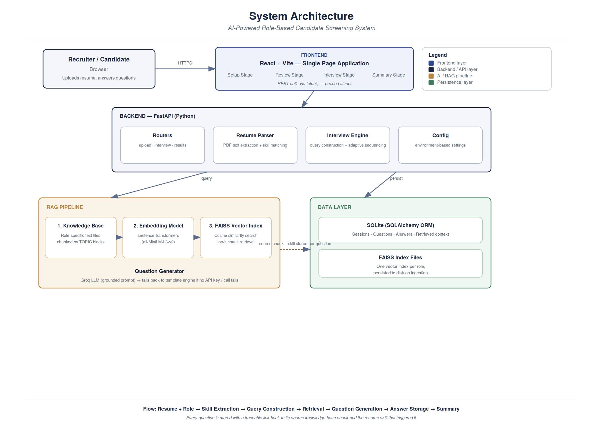
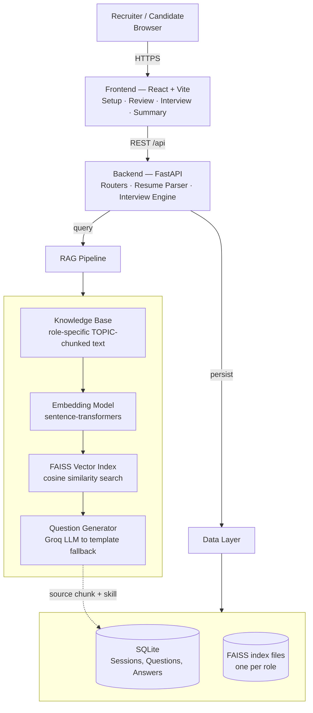

# Panel — AI-Powered Role-Based Candidate Screening System

An intelligent technical screening tool that conducts a structured interview generated entirely
from a candidate's resume and a role-specific knowledge base, using a Retrieval-Augmented
Generation (RAG) pipeline. Built for the PG-AGI AI/ML & Backend Engineering Intern assignment.

---

## Table of Contents

1. [Objective](#1-objective)
2. [Problem Statement](#2-problem-statement)
3. [System Architecture](#3-system-architecture)
4. [Technology Stack](#4-technology-stack)
5. [End-to-End System Flow](#5-end-to-end-system-flow)
6. [AI/ML — RAG Pipeline in Depth](#6-aiml--rag-pipeline-in-depth)
7. [Backend & API Design](#7-backend--api-design)
8. [Key Design Decisions](#8-key-design-decisions)
9. [Project Structure](#9-project-structure)
10. [Setup Instructions](#10-setup-instructions)
11. [Using the Application](#11-using-the-application)
12. [Possible Extensions](#12-possible-extensions)

---

## 1. Objective

This project evaluates and demonstrates the ability to design and implement a real-world
intelligent system that integrates applied AI/ML concepts (specifically RAG), backend system
design, frontend interaction, and end-to-end data flow management — with an emphasis on
architectural clarity and design maturity, not just feature completeness.

## 2. Problem Statement

Given a candidate's resume and a target job role, the system must simulate a structured technical
interview in which questions are **not predefined**, but generated dynamically from:

- the candidate's resume,
- the selected job role, and
- a role-specific knowledge base (retrieved via RAG).

## 3. System Architecture



The system is composed of three independently deployable layers — a React frontend, a FastAPI
backend that owns all orchestration logic, and a data layer combining SQLite (relational,
transactional data) with FAISS (vector search). This separation keeps each layer independently
testable and replaceable — for example, swapping SQLite for Postgres or FAISS for a managed
vector database requires no changes to the frontend or the API contract.

**Mermaid source** for this diagram (regenerate or edit at mermaid.live):



## 4. Technology Stack

| Layer | Technology | Why |
|---|---|---|
| Frontend | React 18 + Vite | Fast dev loop, minimal boilerplate for a 4-stage single-page flow |
| Backend | FastAPI (Python), Uvicorn | Async-native, automatic request validation, self-documenting OpenAPI schema |
| Database | SQLite via SQLAlchemy ORM | Zero-setup persistence; swappable for Postgres by changing one env var |
| Embeddings | sentence-transformers (all-MiniLM-L6-v2) | Small, fast, runs fully locally with no paid API |
| Vector store | FAISS (IndexFlatIP, cosine similarity) | No external service required; sufficient recall at this knowledge-base scale |
| LLM | Groq API (Llama 3.1 8B Instant) | Free tier, fast inference, OpenAI-compatible client |
| Resume parsing | pdfplumber + keyword-based skill matching | Deterministic, dependency-light, no external NLP service |
| Containerization | Docker + docker-compose | One-command reproducible setup |

## 5. End-to-End System Flow

| Stage | What happens |
|---|---|
| 1. Candidate Entry | Recruiter selects a role and uploads the candidate's resume (PDF or .txt) |
| 2. Resume Processing | pdfplumber extracts raw text; a keyword matcher identifies technical skills |
| 3. Context Construction | Each detected skill plus the role label becomes a natural-language retrieval query |
| 4. Knowledge Retrieval | Each query is embedded and matched against the role's FAISS index; top-k relevant chunks returned |
| 5. Question Generation | Retrieved chunk(s) plus the triggering skill are passed to the LLM (or template engine) to produce one grounded, non-generic question |
| 6. Interactive Interview | The candidate answers in the UI; the system maintains session state across questions |
| 7. Response Handling | Every question, its source chunk, triggering skill, and the candidate's answer are persisted |
| 8. Final Output | A summary screen presents stats, an AI-generated closing insight, and the full traceable transcript |

## 6. AI/ML — RAG Pipeline in Depth

**Knowledge ingestion.** Role-specific reference material lives in `backend/app/knowledge_base/*.txt`,
written as labeled `TOPIC:` blocks. This is a deliberate chunking strategy: each chunk is a
complete, self-contained concept rather than an arbitrary fixed-token window, which avoids
splitting an idea across a chunk boundary and preserves context. Each chunk is embedded with
`all-MiniLM-L6-v2` and stored in a `faiss.IndexFlatIP` (cosine similarity via normalized inner
product), persisted to disk per role.

**Retrieval mechanism.** Queries are constructed dynamically — one per resume skill (for example,
"FastAPI in the context of Backend Engineer"), plus a small set of general role topics to ensure
breadth even when few skills are detected. Each query is embedded and matched against the
relevant role's index; the top-k most similar chunks are returned with their similarity scores.

**Question generation.** The retrieved context is passed to the LLM inside a constrained prompt
that instructs it to ground the question only in the supplied material and avoid generic
"What is X?" phrasing. If no LLM key is configured, or a call fails, a template engine assembles
a question from the same retrieved context — the system is never blocked on external API
availability.

**Resume utilisation.** The resume doesn't just gate access — it directly determines which skills
generate queries, which in turn determines topic selection and the direction of the interview.
Every question is tagged with the specific skill that triggered it.

**Output structuring and traceability.** The pipeline stage Context to Query to Retrieval to
Question to Answer to Storage is preserved end to end: each stored Question row keeps its source
topic, retrieved context, and triggering skill alongside the candidate's answer, so the reasoning
behind every question is auditable rather than a black box.

## 7. Backend & API Design

The backend is organized as a set of purpose-built routers, one per stage of the interview
lifecycle, rather than a single monolithic file:

| Endpoint | Purpose |
|---|---|
| GET /roles | Lists available screening roles |
| POST /sessions | Accepts a resume + role; returns extracted skills and a session id |
| POST /interview/{session_id}/start | Runs the first retrieval + generation cycle |
| POST /interview/answer | Stores an answer, returns the next adaptively-chosen question, or marks completion |
| GET /sessions/{session_id}/summary | Returns aggregate stats, an AI-generated insight, and the full transcript |

Input validation is handled declaratively through Pydantic schemas; malformed uploads, unknown
role ids, and unparsable resumes are rejected early with structured error responses rather than
propagating into the pipeline.

## 8. Key Design Decisions

- Topic-based chunking over fixed-token windows, so retrieval never splits one idea across two
  chunks.
- Local embeddings + FAISS instead of a paid vector database — appropriate for this knowledge
  base's scale, with no external dependency once the model is downloaded once.
- Graceful LLM degradation: a deterministic template fallback means the system is always usable,
  LLM key or not, and a failed API call never crashes an in-progress interview.
- Adaptive sequencing: the next question is chosen based on the previous answer's length — a
  short answer routes to another concrete, skill-grounded question; a detailed answer routes to a
  deeper general-topic question.
- Full traceability: every question carries a reference to the exact knowledge-base chunk and
  resume skill that produced it.

## 9. Project Structure

```
screener/
  backend/
    app/
      knowledge_base/     role-specific reference text (TOPIC-chunked)
      rag/                 ingest.py (chunk+embed+index), retrieve.py (query)
      routers/              upload.py, interview.py, results.py
      config.py               environment-driven settings
      models.py                SQLAlchemy ORM models
      schemas.py                Pydantic request/response models
      resume_parser.py           PDF text + skill extraction
      interview_engine.py        query construction + adaptive sequencing
      llm.py                      Groq client + template fallback
      main.py                      FastAPI app entry point
    requirements.txt
    .env.example
  frontend/
    src/
      components/            SetupStage, ReviewStage, InterviewStage, SummaryStage
      api.js
      App.jsx
  docker-compose.yml
  README.md
```

## 10. Setup Instructions

### Prerequisites
- Python 3.10+
- Node.js 18+
- A free Groq API key from console.groq.com/keys (optional — the app runs without one)

### Backend
```bash
cd backend
python -m venv venv
source venv/bin/activate        # Windows: venv\Scripts\activate
pip install -r requirements.txt
cp .env.example .env            # add your GROQ_API_KEY (optional)
uvicorn app.main:app --reload --port 8000
```
On first run, the app downloads the embedding model (about 90 MB) and builds the FAISS indexes —
this requires internet access once, after which everything runs locally.

### Frontend
```bash
cd frontend
npm install
npm run dev
```
Open http://localhost:5173

### Docker (optional)
```bash
docker-compose up --build
```

## 11. Using the Application

1. Select a target role and upload a resume (PDF or .txt).
2. Review the automatically extracted skills.
3. Answer each generated question — the retrieved source topic and triggering skill are shown
   alongside it for transparency.
4. On completion, view the summary: stats, an AI-generated closing insight, and the full
   traceable transcript.

## 12. Possible Extensions

- Semantic answer grading via embedding similarity against reference material
- Multi-turn follow-up questioning within a single topic before advancing
- An interviewer-facing dashboard comparing multiple candidates for the same role
- Swapping SQLite/FAISS for Postgres and a managed vector database for multi-user production use
